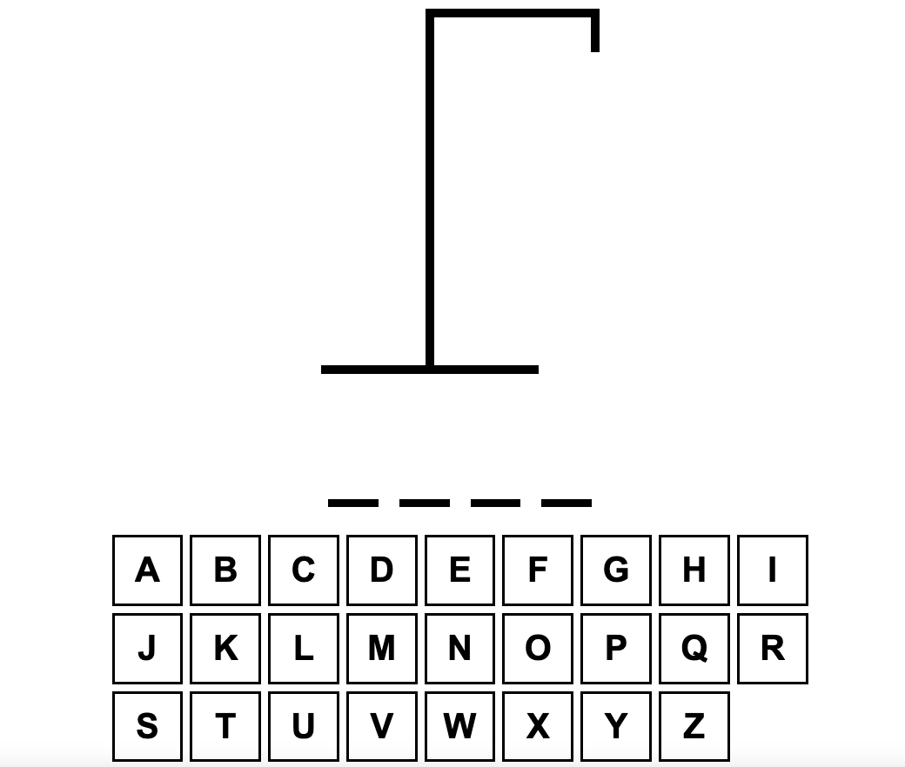
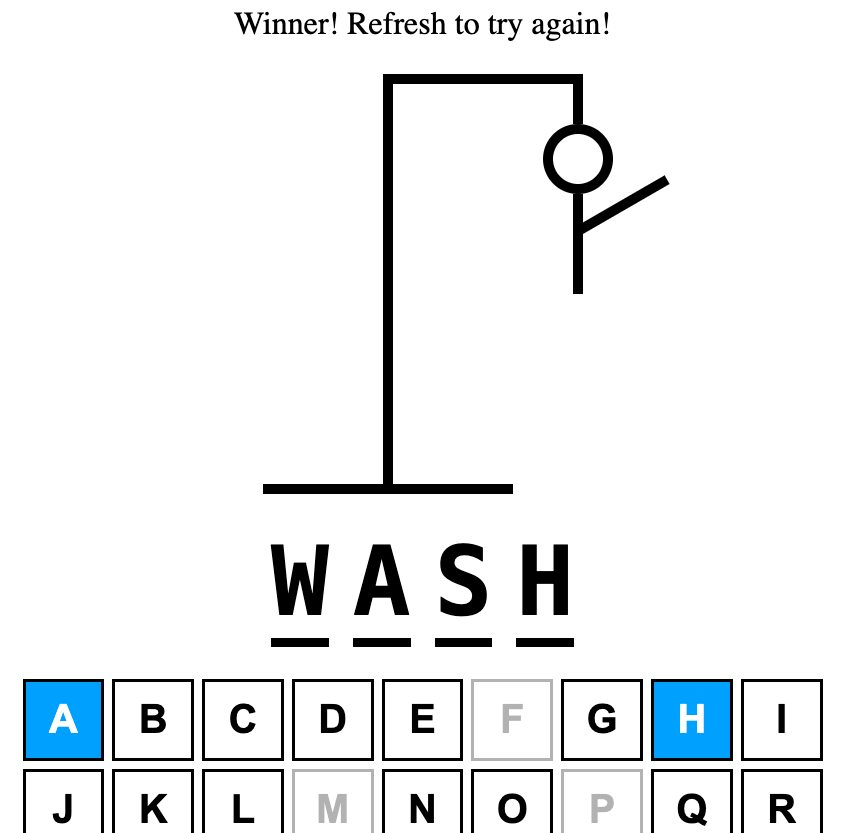
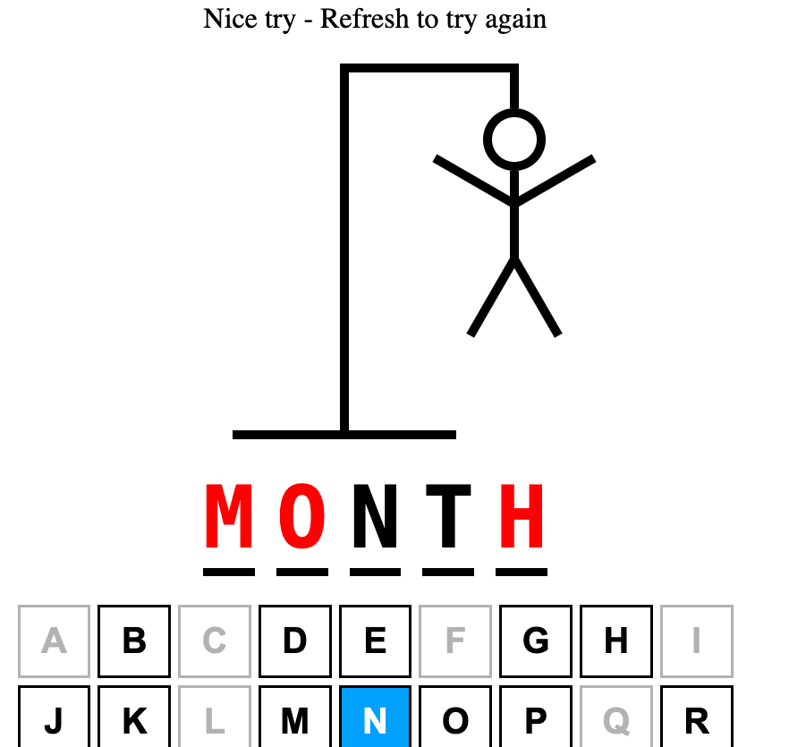

# Hangman game

This is a simple Hangman game which uses React and TypeScript.

The words are sourced from an inbuilt json file and use of event listeners allows users to interact with the game using either their own keyboard or the visual keyboard displayed on the screen.

You can play the game here: [Link to game](https://NDenheim.github.io/hangman-react)

## Game Start

The game starts with the simple hangman drawing and lines to represent the length of the random word, along with the interactive keyboard.

## Winning Game

If the player is successful, all keys are disabled and a message appears at the top of the screen informing them that they have won.

## Losing Game

If the player is unsuccessful, all keys are disabled and the final word shows. As you can see, those letters which were not correctly guessed now appear in red. There is also a message at the top of the screen informing the user that they have lost.

## Game End

To play again, players can either refresh the page or simply press enter on their keyboard.

## Future Features

Features that I plan to add in the future are:

- Ability to view category of word
- Ability to select category of word
- Ability to select difficulty
